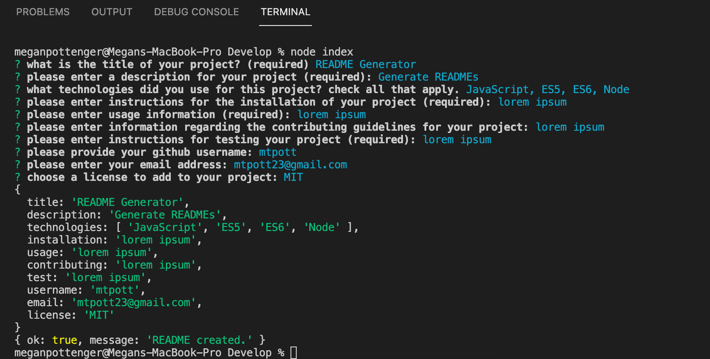

# Professional README Generator

## Screencastify Tutorial
### Please follow the link below to watch a walkthrough of how the README Generator works.
https://drive.google.com/file/d/1X9gLzg70zcqMbf0jeZXDTd4R5c5jaTe4/view

## Description
For this challenge, we were tasked with creating a README generator using Node.js. As per the guidelines, we were to utilize the inquirer package in order to capture user input using the command line. When the user answers the prompts, that information is taken and used in a template literal to fill out the rest of the README framework. In the walkthrough above, I show how to invoke the prompts (by entering node index.js) and what will happen when that information is accessed by the template literal.

## Technologies
This project was built using Node.js.

## Screenshot

## Sample README
Inside of the 'dist' folder, you will find a sample README generated using my code. Please refer to that README in order to see how it ends up on GitHub!